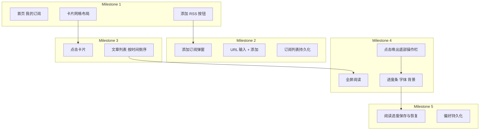

# RSS 阅读器开发计划

## 项目背景与目标

解决个人博客阅读时**无法调整字体大小、阅读区域**的问题，提供可自定义的 RSS 阅读体验。

---

## 技术选型


| 项目      | 选择                                                            |
| ------- | ------------------------------------------------------------- |
| 框架      | React 18 + Vite                                               |
| 样式      | Tailwind CSS                                                  |
| RSS 解析  | `rss-parser`                                                  |
| 存储      | localStorage（订阅列表 + 用户偏好 + 阅读进度）                              |
| CORS 处理 | 通过公共 CORS 代理或 `rss2json` 等 API 获取跨域 RSS（纯前端无法直接 fetch 多数 RSS） |


---

## 核心功能与里程碑




---

## Milestone 1：首页框架

**目标**：首页显示「我的订阅」，订阅以卡片展示，布局整洁，有「添加 RSS」按钮。

**实现要点**：

- 新建 React + Vite 项目，配置 Tailwind
- 首页组件：标题「我的订阅」、卡片网格（`grid` 布局，卡片间距 `gap-4` 或 `gap-6`）
- 订阅卡片：展示站点名称、图标/ favicon、条目数量（可先为占位数据）
- 右下角或顶部固定「添加 RSS」按钮
- 从 `localStorage` 读取订阅列表，空时显示「暂无订阅」提示

**产出**：可运行的首页，卡片布局美观，无功能交互。

---

## Milestone 2：添加订阅

**目标**：点击「添加 RSS」后出现弹窗，输入 RSS URL，点击「添加」可成功订阅。

**实现要点**：

- 模态框组件：遮罩 + 居中面板，内含一个 URL 输入框和一个「添加」按钮
- 校验输入：非空、形如 URL
- 使用 `rss-parser` + CORS 代理（如 `https://api.allorigins.win/raw?url=`）请求并解析 RSS
- 解析成功后：提取 `title`、`link`、`description` 等，加入订阅列表，写入 `localStorage`
- 错误处理：无效 URL、解析失败、网络错误时给出提示

**产出**：可从任意有效 RSS URL 添加订阅并持久化。

---

## Milestone 3：文章列表

**目标**：点击某张订阅卡片，进入该订阅的文章列表，按发布时间倒序展示。

**实现要点**：

- 路由：首页 `/`，文章列表 `/feed/:feedId`
- 文章列表页：展示订阅标题，列表自上而下按 `pubDate` 降序
- 每条文章：标题、发布时间、摘要（可选）
- 点击某条文章：进入阅读视图（下一里程碑实现）
- 首次进入时拉取该订阅最新内容并缓存到 `localStorage`，减轻重复请求

**产出**：点击卡片可查看按时间排序的文章列表。

---

## Milestone 4：全屏阅读 + 底部操作栏

**目标**：全屏阅读单篇文章，点击页面任意位置从底部浮现操作栏，内含进度、字体、背景设置。

**实现要点**：

- 路由：`/read/:feedId/:articleId`
- 阅读页：全屏、简洁，无多余元素
- **交互**：点击页面任意位置（或内容区域）→ 底部操作栏自下而上平滑浮出（`transform: translateY` + `transition`）
- **操作栏布局**（从左到右依次）：
  1. **进度**：可拖动的进度条，实时显示当前阅读位置（基于滚动高度计算：`scrollTop / (scrollHeight - clientHeight)`），拖动时跳转到对应位置
  2. **字体**：宋体、黑体等（字体选项由您后续指定），点击切换
  3. **背景**：白色、深色、黄色、绿色四色切换
- 操作栏可再次点击外部区域或特定按钮收起
- 阅读区域：根据字体、背景设置即时生效

**产出**：可全屏阅读，点击唤出底部操作栏，调节进度、字体、背景。

---

## Milestone 5：进度保存与偏好持久化

**目标**：**必须**实现阅读进度保存与恢复；字体、背景等偏好持久化，下次打开自动应用。

**实现要点**：

- **阅读进度保存**（核心）：
  - 以 `feedId + articleId` 为键，存储滚动位置（`scrollTop`）或百分比
  - 监听 `scroll` 事件，防抖（如 300ms）后写入 `localStorage`
  - 进入阅读页时：优先读取已保存进度，恢复到对应位置
  - 存储结构示例：`{ [articleKey]: { scrollTop: number, updatedAt: number } }`
- **偏好持久化**：
  - 字体、背景、字体大小等写入 `readingPreferences`
  - 再次打开任意文章时自动应用
- 可选：添加「返回列表」「返回首页」等导航

**产出**：每次阅读进度可恢复；字体、背景偏好全局生效并持久保存。

---

## 项目结构示意

```
RSSnow/
├── src/
│   ├── App.tsx
│   ├── main.tsx
│   ├── index.css
│   ├── components/
│   │   ├── FeedCard.tsx        # 订阅卡片
│   │   ├── AddFeedModal.tsx    # 添加订阅弹窗
│   │   ├── ArticleList.tsx     # 文章列表
│   │   ├── Reader.tsx          # 全屏阅读
│   │   └── ReaderToolbar.tsx   # 底部操作栏（进度、字体、背景）
│   ├── hooks/
│   │   ├── useFeeds.ts         # 订阅 CRUD
│   │   └── useRssParse.ts      # RSS 解析
│   ├── stores/
│   │   ├── preferences.ts      # 字体、背景等偏好
│   │   └── readingProgress.ts  # 阅读进度存储与恢复
│   └── utils/
│       └── storage.ts          # localStorage 封装
├── package.json
├── vite.config.ts
└── tailwind.config.js
```

---

## 注意事项

1. **CORS**：浏览器中直接 `fetch` 多数 RSS 会报错，需通过代理或第三方 API 拉取，计划中使用类似 `allorigins.win` 或 `rss2json` 的方案。
2. **RSS 与 Atom**：`rss-parser` 支持 RSS 2.0 与 Atom，可覆盖常见博客。
3. **节奏**：每个 Milestone 实现并本地验证后暂停，供您确认后再进入下一阶段。
4. **字体选项**：M4 中先实现宋体、黑体等常用字体，您后续可指定要支持的完整列表。

---

## 开发顺序

按 **Milestone 1 → 2 → 3 → 4 → 5** 顺序执行。每完成一个 Milestone，暂停并请您确认，再继续下一个。